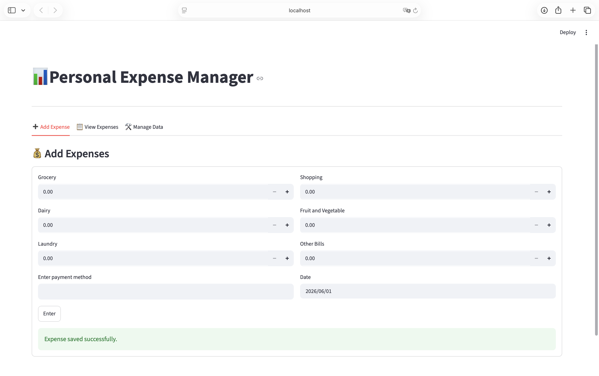
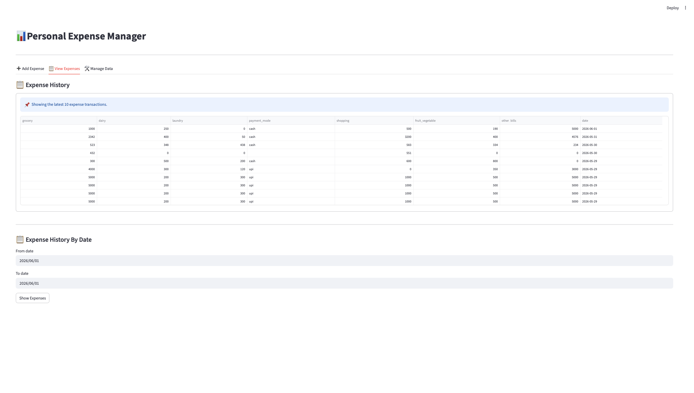
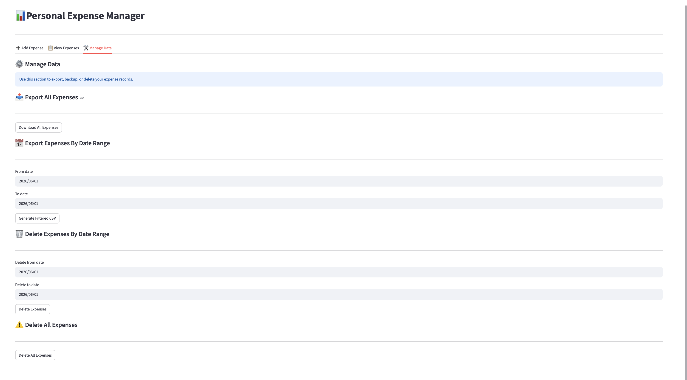

# Personal Expense Manager

Personal Expense Manager is a beginner-friendly Streamlit web application for tracking daily expenses with a local SQLite database. It allows users to add new expense records, review recent transactions, filter expenses by date range, generate total summaries by category, export records to CSV, and delete data safely with confirmation steps.

## Project Description

This project is designed as a simple personal finance tracker and a portfolio-ready Python application. It combines a clean Streamlit user interface with SQLite for local data storage, making it easy to run without any external database setup.

## Features

- Add expense records using a simple form
- Track categories such as grocery, dairy, laundry, shopping, fruit and vegetable, and other bills
- Save payment mode and date for each expense
- Store expense data in a local SQLite database
- View the latest 10 expense transactions
- Filter expense history by date range
- Show category-wise total expense summary for a selected date range
- Export all expenses to CSV
- Export filtered expenses by date range to CSV
- Delete expenses by date range using a confirmation flow
- Delete all expense records using a confirmation flow

## Screenshots







## Project Structure

```text
Personal_Tracker/
├── app/
│   └── main.py
├── core/
│   ├── expenses.py
│   └── managedata.py
├── data/
│   └── document.db
├── db/
│   ├── database.py
│   └── repositry.py
├── screenshots/
│   ├── expense_history.png
│   ├── home_page.png
│   └── manage_data.png
├── requirements.txt
├── README.md
└── .gitignore
```

## Technologies Used

- Python 3.13.7
- Streamlit
- Pandas
- SQLite

## Installation

### 1. Clone the repository

```bash
git clone https://github.com/YOUR-GITHUB-USERNAME/personal-expense-manager.git
cd Personal_Tracker
```

### 2. Create a virtual environment

On macOS/Linux:

```bash
python3 -m venv .venv
```

On Windows:

```bash
python -m venv .venv
```

### 3. Activate the virtual environment

On macOS/Linux:

```bash
source .venv/bin/activate
```

On Windows PowerShell:

```powershell
.venv\Scripts\Activate.ps1
```

On Windows Command Prompt:

```cmd
.venv\Scripts\activate
```

### 4. Install requirements

```bash
pip install -r requirements.txt
```

## Run the Application

Run the Streamlit app from the project root:

```bash
streamlit run app/main.py
```

After starting, Streamlit will usually open in your browser at:

```text
http://localhost:8501
```

## Example Workflow

1. Open the application in your browser.
2. Go to the `Add Expense` tab.
3. Enter values for grocery, dairy, laundry, shopping, fruit and vegetable, other bills, payment mode, and date.
4. Click `Enter` to save the expense.
5. Open the `View Expenses` tab to see the latest 10 transactions.
6. Select a date range and click `Show Expenses` to view filtered records.
7. Click `Show Total Summary` to see category-wise totals for that selected date range.
8. Open the `Manage Data` tab to export all records, export filtered records, delete records by date range, or delete all records.

## Database Notes

- This project uses **SQLite** as a local database.
- The database file is stored in the `data/` folder as `document.db`.
- The app initializes the `expenses` table automatically if it does not already exist.
- No separate database server is required to run this project.

## Future Improvements

- Add an analytics dashboard
- Add charts and visual summaries
- Add monthly reports
- Add edit and update functionality
- Add user authentication
- Add cloud deployment support

## Author

**Mona Verma**

GitHub: https://github.com/YOUR-GITHUB-USERNAME

## Python Version

This project was developed with **Python 3.13.7**.
